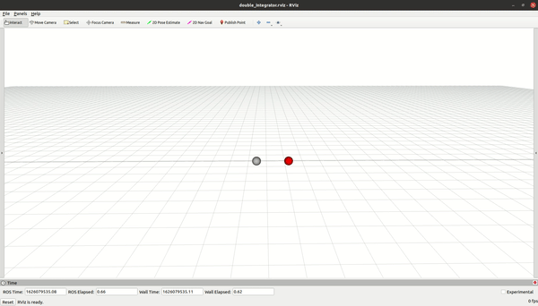
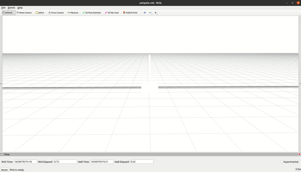
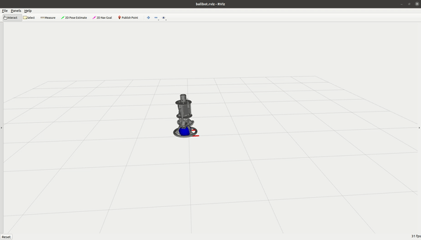
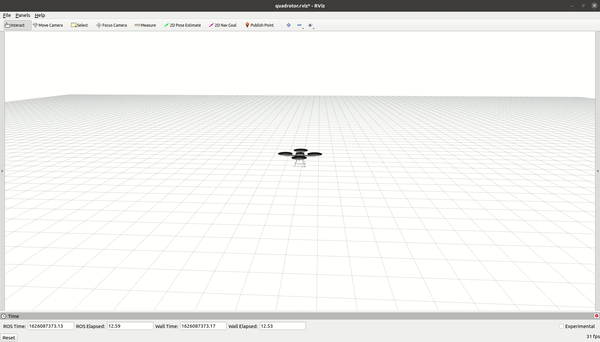
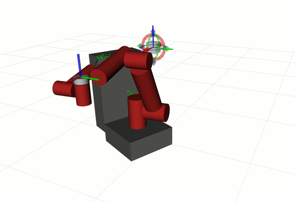
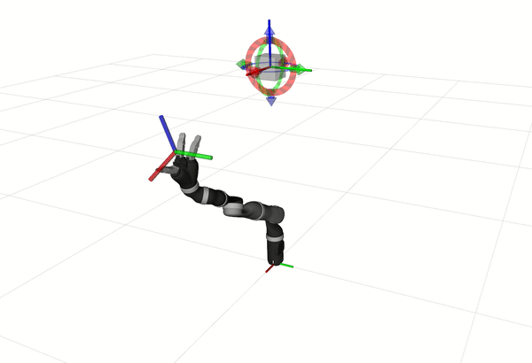
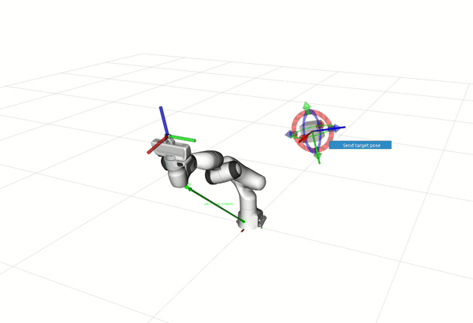
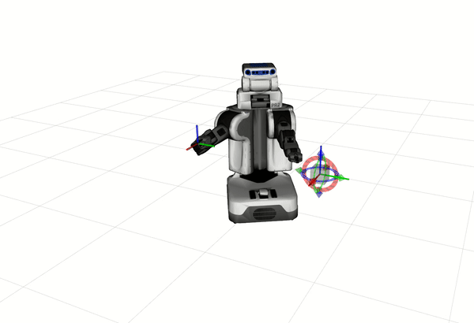
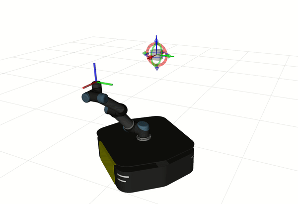
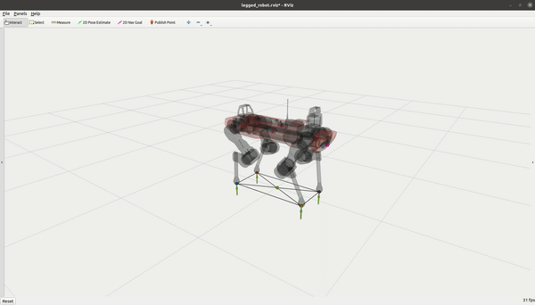

.. index:: pair: page; Robotic Examples

.. _doxid-ocs2_doc_robotic_examples:

Robotic Examples
================

OCS2 includes several robotic examples. We here briefly discuss the main
features of each example.

================== ========== ========== =========== ========
System             State Dim. Input Dim. Constrained Caching
================== ========== ========== =========== ========
Double Integrator  2          1          No          No
Cartpole           4          1          Yes         No
Ballbot            10         3          No          No
Quadrotor          12         4          No          No
Mobile Manipulator 6-13       6-13       Yes         Yes / No
Legged Robot       24         24         Yes         No
================== ========== ========== =========== ========

For all these robotic examples, there are two separate packages:

1. **ocs2_<robot>**: Provides the library with the robot-specific MPC implementation.
2. **ocs2_<robot>_ros**:  Wraps around the MPC implementation with ROS to define ROS nodes.

.. _doxid-ocs2_doc_robotic_examples_double_integrator:

Double Integrator
^^^^^^^^^^^^^^^^^

The double integrator example is our simplest problem. It models a 1D
point mass that moves in the x-direction. The model is linear, and the
cost function is quadratic. The target point is set to the quadratic
cost through a reference manager module.

.. code-block:: bash

    # Build the example
    catkin build ocs2_double_integrator_ros
    # Source workspace
    # Do not forget to change <...> parts
    source <directory_to_ws>/<catkin_ws_name>/devel/setup.bash

    # Launch the example
    roslaunch ocs2_double_integrator_ros double_integrator.launch

.. _doxid-ocs2_doc_robotic_examples_cartpole:

Cartpole
^^^^^^^^^

The cartpole example is a classic control problem where a pole is
attached through an unactuated joint to a cart. The car moves along a
frictionless track. The goal is to swing up and balance the pendulum
starting from the downright position by accelerating a decelerating the
cart along the track. 

.. code-block:: bash

    # Build the example
    catkin build ocs2_cartpole_ros
    # Source workspace
    # Do not forget to change <...> parts
    source <directory_to_ws>/<catkin_ws_name>/devel/setup.bash

    # Launch the example
    roslaunch ocs2_cartpole_ros cartpole.launch

.. _doxid-ocs2_doc_robotic_examples_ballbot:

Ballbot
^^^^^^^

The Ballbot example is a 5DoF system. The platform is a
torque-controlled, omnidirectional robot that balances on a ball through
three omni-wheels. The system has nonlinear dynamics and exhibits
non-minimum-phase behavior. The system dynamics is based on the
Ballbot’s forward dynamics, and the linear approximation of the flow-map
is calculated through auto differentiation. The task objective is to
control the robot’s XY position and yaw based on user command. 

.. code-block:: bash

    # Build the example
    catkin build ocs2_ballbot_ros
    # Source workspace
    # Do not forget to change <...> parts
    source <directory_to_ws>/<catkin_ws_name>/devel/setup.bash

    # Launch the example
    roslaunch ocs2_ballbot_ros ballbot.launch

.. _doxid-ocs2_doc_robotic_examples_quadrotor:

Quadrotor
^^^^^^^^^

The quadrotor example is a 6DoF system. The platform is modeled as a
floating-base, rigid-body dynamics with a 3D moment and 1D force control
in the normal direction to the robot. The system dynamics and its
derivative are code generated. This example aims to track the user
command defined as the quadrotor’s 3D position and yaw. 

.. code-block:: bash

    # Build the example
    catkin build ocs2_quadrotor_ros
    # Source workspace
    # Do not forget to change <...> parts
    source <directory_to_ws>/<catkin_ws_name>/devel/setup.bash

    # Launch the example
    roslaunch ocs2_quadrotor_ros quadrotor.launch

.. _doxid-ocs2_doc_robotic_examples_mobile_manipulator:

Mobile Manipulator
^^^^^^^^^^^^^^^^^^

The mobile manipulator example is a fully kinematic problem. The model
consists of a 6DOF arm plus 2D position and heading of the mobile base.
The control inputs are the 6 joint velocities of the arm and the forward
and rotational velocities of the base. The objective of the task is to
track a 6DoF end-effector pose. The joint position and velocity limits
are included in the constraint of the optimal control problem.
Self-collision avoidance is achieved based on the collision
bodies in the URDF model and collision avoidance constraints (refer to
ocs2_self_collision). 

Note: This example implements both the cache and the
non-cache variants of the MPC, which can be chosen through the
usePreComputation flag in the config file. 

The system model is determined by parsing the URDF and the task file. 
Currently, the following system models are supported:

* **Default** (*value:* 0): The default system model obtained by parsing the URDF.
* **Actuated Dummy wheel-base** (*value:* 1): Adds a dummy XY-Yaw joints to the 
  model parsed from the URDF which are actuated under holonomic constraint 
  (velocity-control). This is a model of a mobile-manipulator with a base controlled
  in SE(2).
* **Unactuated Dummy floating-base** (*value:* 2): Adds a dummy XYZ-RPY joints to the 
  model parsed from the URDF which are unactuated.
* **Actuated Dummy floating-base** (*value:* 3): Adds a dummy XYZ-RPY joints to the 
  model parsed from the URDF which are fully-actuated (velocity-control). This is a 
  model of a mobile-manipulator with a base controlled in SE(3).

To play-around different model types, you can change the model-information in the 
`task.info` files.

.. code-block:: bash

    # Build the example
    catkin build ocs2_mobile_manipulator_ros
    # Source workspace
    # Do not forget to change <...> parts
    source <directory_to_ws>/<catkin_ws_name>/devel/setup.bash

For several common robot manipulators, we provide examples on running them
with OCS2. The steps taken to generate the robot model files (URDF) are 
available `here <https://github.com/leggedrobotics/ocs2_robotic_assets/blob/main/docs/MobileManipulatorUrdfAssets.md>`_.

For some of these examples, we fix certain joints present in the URDF (such as the gripper 
finger joints or wheel joints) through the `model_information.removeJoints` attribute in 
the `task.info` file. This allows simplifying the constructed Pinocchio model. Only for
visualization purposes on rviz, the joints under `removeJoints` in the `task.info` are published
at zero joint positions by the dummy simulation node . 

.. warning::
    For these examples, additional tuning of the MPC might be required to work on hardware.
    Additionally, for some of the examples, the collision meshes need to be simplified into
    primitive shapes (such as cylinders and boxes) to allow collision avoidance.

    We welcome contributions from the community for these use-cases.

Mabi-Mobile
~~~~~~~~~~~

.. code-block:: bash

    roslaunch ocs2_mobile_manipulator_ros manipulator_mabi_mobile.launch

Kinova Jaco2
~~~~~~~~~~~~~~~~~

.. code-block:: bash

    # For 6-Dof
    roslaunch ocs2_mobile_manipulator_ros manipulator_kinova_j2n6.launch
    # For 7-Dof
    roslaunch ocs2_mobile_manipulator_ros manipulator_kinova_j2n7.launch

Franka Panda
~~~~~~~~~~~~

.. code-block:: bash

    roslaunch ocs2_mobile_manipulator_ros manipulator_franka.launch

Willow Garage PR2
~~~~~~~~~~~~~~~~~

.. code-block:: bash

    roslaunch ocs2_mobile_manipulator_ros manipulator_pr2.launch

Clearpath Ridgeback with UR-5
~~~~~~~~~~~~~~~~~~~~~~~~~~~~~

.. code-block:: bash

    roslaunch ocs2_mobile_manipulator_ros manipulator_ridgeback_ur5.launch

.. _doxid-ocs2_doc_robotic_examples_legged_robot:

Legged Robot
^^^^^^^^^^^^

The legged robot example is a switched system problem. It implements an
MPC approach for motion control of a quadrupedal robot, Anymal. The
robot’s gait is defined by the user and can be modified during the
execution through a solver synchronized module (GaitReceiver). The mode
sequence and the target trajectories are defined through a reference
manager module (SwitchedModelReferenceManager). The cost function is a
quadratic penalty to track the commanded base position and yaw and
equally distribute the weight of the robot on the stance feet. The
problem has several mode-depended constraints, such as zero force for
the swing feet and zero velocity for the stance feet. The friction cone
is enforced on the contact forces, and to avoid foot scuffing, the swing
feet track a predefined motion in the z-direction.

The system dynamics are modeled in two ways which can be chosen from the
config file: (1) The single rigid body dynamics (SRBD): This model
assumes that the system has constant inertia regardless of its joint
positions. It also includes the full kinematics of the system (2) The
full centroidal dynamics (FCD): This model uses the centroidal dynamics,
which incorporates the motion of the robot’s limbs. Similar to SRBD, it
considers the full kinematics of the robot.

.. code-block:: bash

    # Build the example
    catkin build ocs2_legged_robot_ros
    # Source workspace
    # Do not forget to change <...> parts
    source <directory_to_ws>/<catkin_ws_name>/devel/setup.bash

    # Launch the example for DDP
    roslaunch ocs2_legged_robot_ros legged_robot_ddp.launch
    # OR launch the example for SQP
    roslaunch ocs2_legged_robot_ros legged_robot_sqp.launch

